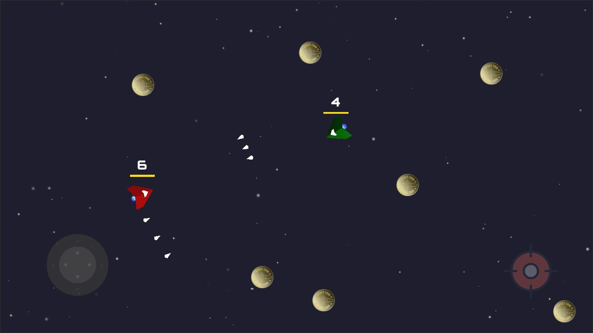

# Space Combat

The repository contains an implementation of the Test task.

## Task Conditions

* Create a 2D game for Android on Unity, where 2 or more players from 
different Android devices can enter the lobby

* Development Environment - Unity 2021.3.9f1

## Project Requirements

* Scenes

    * The game must have 3 scenes: Loading, Lobby, Game
  
* Technology stack description

    * To complete the task, you can use any free network engine and cloud 
    service to create scalable cross-platform multiplayer games
  
* Lobby

    * The lobby should be able to create a room and enter it, as well as 
    connect to a room already created by another player. Lobby scene contains 
    two fields with buttons, in one field the player can write the name of the 
    room, and then click the “Create” button, in the other field the player 
    writes the name of the created room, presses the “Enter” button and waits 
    for another player to enter on another device to a room with the same name
  
* Gameplay

    * After entering the room, players enter the battle server and the game 
    process begins. There is a field, limited by the size of the screen, 
    scattered with lootable coins that each player can collect

    * When at least 2 players appear on the playing field, each of them has the 
    ability to turn and move in a certain direction, as well as shoot in the 
    direction where it looks. Virtual joystick control is used to control the 
    player
    
    * The player has a health bar and a scale for collecting coins

    * If a player is hit by a projectile fired by another player, the health bar 
    decreases
        
    * Players must be visually distinct from each other (name, color or shape)

    * The game ends when 1 player is left alive. After that, a winning pop-up 
    appears with information indicating the name of the winner and how many coins 
    he collected

# Usage

* Clone the repo as usual via cmd/terminal or in your favorite Git GUI 
software

* Open the project folder in Unity Hub using 2021.3.9f1 or a more recent 
of 2021.3 editor versions

* The Loading scene is the entry point to the application. The location of this 
file is "Assets/_SpaceCombat/Scenes/Loading.unity"

* Of the third-party tools, only Photon PUN2 and Simle Input are used in the 
project
  

# License

    The MIT License (MIT)

    Copyright (c) 2023 Alexander Shkurlatov

    Permission is hereby granted, free of charge, to any person obtaining a copy
    of this software and associated documentation files (the "Software"), to deal
    in the Software without restriction, including without limitation the rights
    to use, copy, modify, merge, publish, distribute, sublicense, and/or sell
    copies of the Software, and to permit persons to whom the Software is
    furnished to do so, subject to the following conditions:

    The above copyright notice and this permission notice shall be included in all
    copies or substantial portions of the Software.

    THE SOFTWARE IS PROVIDED "AS IS", WITHOUT WARRANTY OF ANY KIND, EXPRESS OR
    IMPLIED, INCLUDING BUT NOT LIMITED TO THE WARRANTIES OF MERCHANTABILITY,
    FITNESS FOR A PARTICULAR PURPOSE AND NONINFRINGEMENT. IN NO EVENT SHALL THE
    AUTHORS OR COPYRIGHT HOLDERS BE LIABLE FOR ANY CLAIM, DAMAGES OR OTHER
    LIABILITY, WHETHER IN AN ACTION OF CONTRACT, TORT OR OTHERWISE, ARISING FROM,
    OUT OF OR IN CONNECTION WITH THE SOFTWARE OR THE USE OR OTHER DEALINGS IN THE
    SOFTWARE.